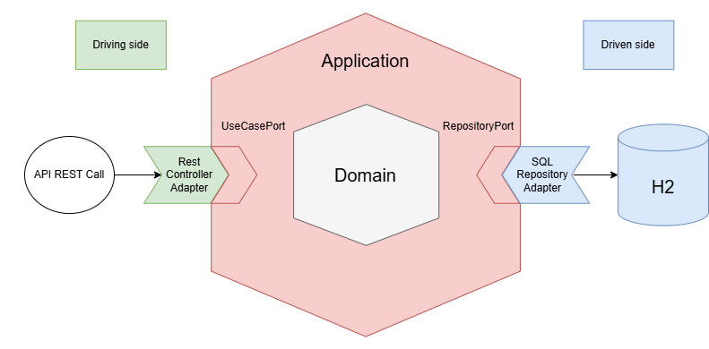

# ecommerce-backend-app

## How to run the application
Execute `mvn clean install` in the project directory in order to install the dependencies and run all tests.
Execute `mvn spring-boot:run` in the project directory in order to run the project.

## System Analysis

### System Definition
The system described is a small backend application for an ecommerce shop.

The system, in short, stores product’s prices in a database table called PRICES among other relevant data, such as the dates in which those prices apply, their priority, the dates in which those prices apply, etc. The PRICES table contains the following data:

| BrandId | StartDate           | EndDate             | PriceList | ProductId | Priority | Price  | Currency | LastUpdate         | LastUpdateBy |
|---------|---------------------|---------------------|-----------|-----------|----------|--------|----------|--------------------|--------------|
| 1       | 2020-06-14-00.00.00 | 2020-12-31-23.59.59 | 1         | 35455     | 0        | 35.50  | EUR      | 2020-03-26-14.49.07 | user1        |
| 1       | 2020-06-14-15.00.00 | 2020-06-14-18.30.00 | 2         | 35455     | 1        | 25.45  | EUR      | 2020-05-26-15.38.22 | user1        |
| 1       | 2020-06-15-00.00.00 | 2020-06-15-11.00.00 | 3         | 35455     | 1        | 30.50  | EUR      | 2020-05-26-15.39.22 | user2        |
| 1       | 2020-06-15-16.00.00 | 2020-12-31-23.59.59 | 4         | 35455     | 1        | 38.95  | EUR      | 2020-06-02-10.14.00 | user1        |

The system must be able to be queried to return the top priority fees and final prices for given products on a given date.

### System architecture
The system will follow the hexagonal architecture or the “ports and adapters” design pattern, where the API will be in the “driving” side and the database in the “driven” side.

### System Requirements

#### Database
The database consist of PRICES table, which can be defined as follows:

##### PRICES
| Column Name    | Column Type                |
|----------------|----------------------------|
| brand_id       | INTEGER (fk to BRAND table) |
| start_date     | TIMESTAMP                 |
| end_date       | TIMESTAMP                 |
| price_list     | INTEGER (fk to PRICE_LIST table) |
| product_id     | INTEGER (fk to PRODUCTS table)   |
| priority       | INTEGER                   |
| price          | DECIMAL(6, 2)            |
| currency       | VARCHAR(3)               |
| lastUpdate     | TIMESTAMP                |
| lastUpdateBy   | VARCHAR(32)              |

We can define the PK of each row as the **brandId**, **productId**, **startDate**, **endDate** and **priority**. This comes from the fact that if two products have the same values for each of these fields, then we cannot effectively distinguish which price and fee to apply when querying this table.

As it can be seen, I have declared brandId, productId and priceList as foreign keys as I consider these fields reference to other tables. The reason to consider the existence of those other tables is that we may potentially add new information to a brand (like name, NIF…), to a product (like name, sku…) or to a fee (percentage, creationDate…). I decided to name them **BRANDS**, **PRODUCTS** and **PRICE_LIST**, respectively. We can define them in a simple way as follows:

##### BRANDS
| Column Name | Column Type   |
|-------------|---------------|
| id          | INTEGER (pk) |
| name        | VARCHAR(32)  |

##### PRODUCTS
| Column Name | Column Type   |
|-------------|---------------|
| id          | INTEGER (pk) |
| name        | VARCHAR(32)  |

##### PRICE_LIST
| Column Name | Column Type   |
|-------------|---------------|
| id          | INTEGER (pk) |

#### API REST Endpoint
The system requires an API REST endpoint which, given a product of a brand on a given arbitrary date, returns the top priority final price, fee and the dates in which that price applies for said product.

In order to do this I have followed the **contract-first design approach** using the OpenAPI Specification. 

The application has Swagger implemented, so if the application is running you can access Swagger UI in order to visualise it the endpoint design. Just click [here](http://localhost:8080/swagger-ui.html) or go to http://localhost:8080/swagger-ui.html.

Otherwise you can access the yaml definition file [here](src\main\resources\static\api-contract.yml).
